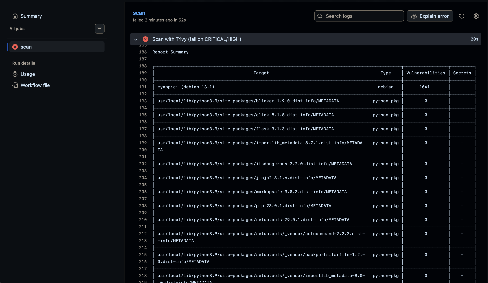

# Docker Image Hardening Pipeline

I took a naive Python/Flask container — 1.6 GB, over 1,200 critical and high CVEs — and worked it down to a 100 MB distroless image with 28. Every version along the way got scanned, gated in CI, and given an SBOM. This repo is the trail of how I got there and what I learned arguing with the scanners.

[](https://github.com/MetaMaaz/docker-security-pipeline/actions/workflows/security.yml)


## The point

I didn't want to just know that hardening helps. I wanted numbers. So each Dockerfile is a deliberate version, scanned with Trivy and cross-checked with Docker Scout, and I kept the results instead of the vibes.

## Results

Trivy `CRITICAL` + `HIGH`, same Flask app every time:

| Version | Base image | CRITICAL | HIGH | Total | Size |
|---|---|--:|--:|--:|--:|
| v1-naive | `python:3.9` | 190 | 1023 | 1213 | 1.6 GB |
| v2-slim | `python:3.9-slim` | 5 | 34 | 39 | 226 MB |
| v3-nonroot | multi-stage `python:3.12-slim`, `USER appuser` | 2 | 9 | 11 | 210 MB |
| v4-distroless | `gcr.io/distroless/python3-debian12` | 2 | 26 | 28 | 99.8 MB |

1213 CVEs down to 28, and 1.6 GB down to 100 MB.

## What each step actually bought

The slim base did almost all the work. Swapping the full `python` image for `-slim` killed roughly 97% of the CVEs, just by dropping OS packages the app never touches. Everything after that was smaller, sharper gains.

Going multi-stage and non-root kept the build tooling in the build stage, so the runtime image ships the app and its deps and nothing else, running as `appuser` instead of root. If something does get popped, it has a lot less to play with.

Distroless took it further: no shell, no package manager, no perl, and half the size of slim.

## The part I didn't expect: distroless made the CVE count go up

v4 reports 28 versus v3's 11. On paper that looks like a regression, and it confused me for a while.

It's the base lagging. The official distroless image is still on Debian 12 while slim has already moved to Debian 13, so it carries older packages. But the count alone misses what changed. The distroless image is half the size, and there's no shell to drop into — `docker run --rm -it myapp:v4-distroless sh` just fails, because the entrypoint is `python3` and `sh` gets read as a script name. The perl RCE and path-traversal CVEs that v3 carried are gone here, not patched, just absent, because perl was never installed. And when I read what the remaining 28 actually are, nearly all of them are deferred or won't-fix DoS bugs in libraries the app never calls — sqlite, expat, ncurses, zlib.

So the number went up and the image got safer. That's the whole lesson sitting in one table row: read the CVEs, don't just count them.

## The CI gate

`.github/workflows/security.yml` rebuilds the distroless image on every push and PR and scans it with `aquasecurity/trivy-action`:

```yaml
severity: CRITICAL,HIGH
ignore-unfixed: true
exit-code: 1
```

`ignore-unfixed: true` is the important line. It tells the gate to fail only on CVEs that have a fix you could actually apply, so the build breaks on real, actionable risk instead of nagging about base-OS noise nobody can patch.

The first run failed anyway. Two fixable base-image CVEs — `CVE-2025-13836` and `CVE-2026-45447` — are patched in Debian but haven't landed in the distroless base yet, and re-pulling just gave me the same digest. I didn't want to either ignore a red build or weaken the gate, so I added a `.trivyignore` listing exactly those two IDs, dated, with a note to re-pin the base and delete the lines once distroless rebuilds. Risk accepted, on paper, with an expiry plan.

To prove the gate isn't just decoration, I pushed a throwaway branch that pointed the build at `Dockerfile.v1-naive` and let it run. It failed exactly as it should — Trivy counted over a thousand OS-level CVEs and the step exited non-zero, blocking the merge:



## Supply chain

`results/sbom.json` is the SPDX bill of materials from Syft — 41 components. You can see from the SBOM alone that there's no shell, no apt, no perl, which means my "small attack surface" claim isn't something you have to take on faith.

The scanner disagreement was my favorite find. On the exact same image, Docker Scout said `0C/0H/0M/1L` and Trivy said 28. Different databases: Scout doesn't bother surfacing the unfixable base-OS DoS bugs. But the one LOW that Scout caught and Trivy's gate filtered out by design was a real Flask 3.0.0 CVE (`CVE-2026-27205`). So I bumped Flask to 3.1.3 and re-scanned, and Scout went clean. Neither scanner had the full picture on its own — that's the takeaway I'll repeat in an interview.

The final image is published to `ghcr.io/metamaaz/myapp:v4-distroless` (and `:latest`), public, MIT.

## Layout

```
.dockerignore
.trivyignore                     # 2 risk-accepted CVE IDs, dated and documented
.github/workflows/security.yml   # CI security gate
app/app.py
app/requirements.txt             # flask==3.1.3
dockerfiles/Dockerfile.v1-naive
dockerfiles/Dockerfile.v2-slim
dockerfiles/Dockerfile.v3-nonroot
dockerfiles/Dockerfile.v4-distroless
results/sbom.json
results/scan-results.md          # the full write-up
results/scout-summary.txt
LICENSE
```

Build any version from the repo root:

```bash
docker build -f dockerfiles/Dockerfile.v4-distroless -t myapp:v4-distroless .
```

## What I'd tell someone starting this

Reach for the slim base before anything clever — it's most of the win. Don't read a lower CVE number as a safer image without checking the base distro, the fix status, and whether the vulnerable code is even reachable. And run two scanners, because the place where they disagree is the place you actually learn something.

## License

MIT
